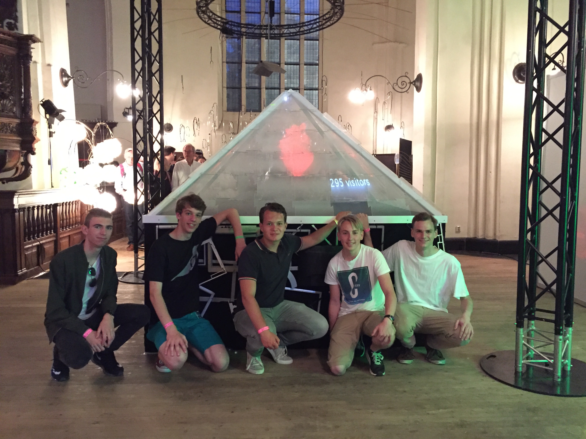

# Pepper'sGhostPyramid
Hologram pyramid made from recycled computer screens.
---
###Prototypes:

First prototype for a project with Fablab Groningen and David Voordes about recycling TFT screens.

###Nacht van Kunst en Wetenschap:

Project for the Nacht van Kunst en Wetenschap (Night of Art & Science) in Groningen. Was displayed at the Der Aa Kerk on June 4th 2016.

